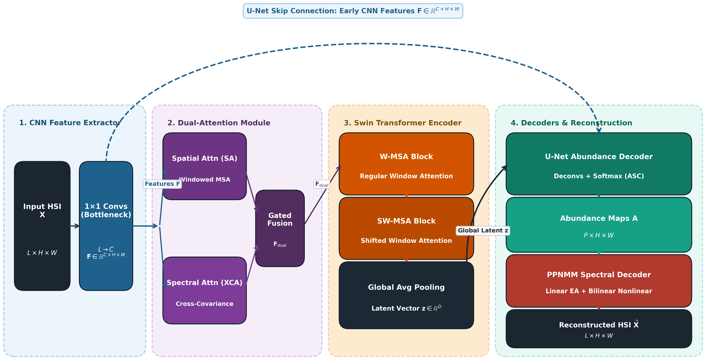
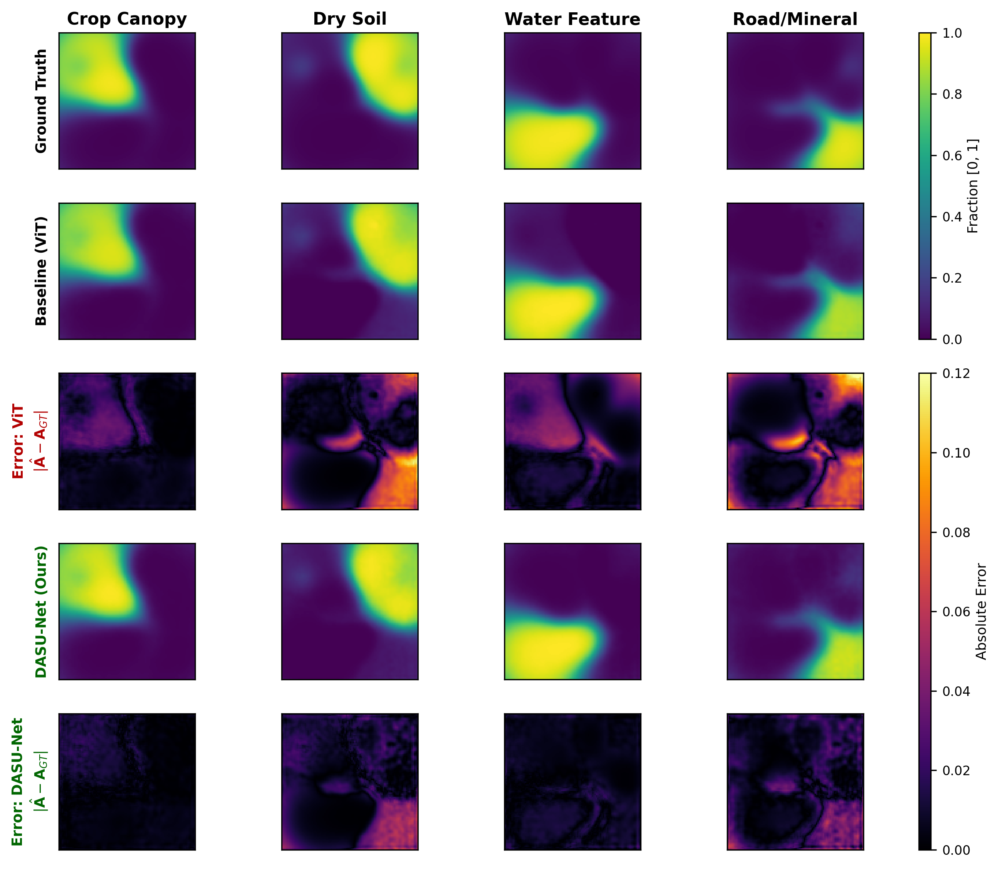
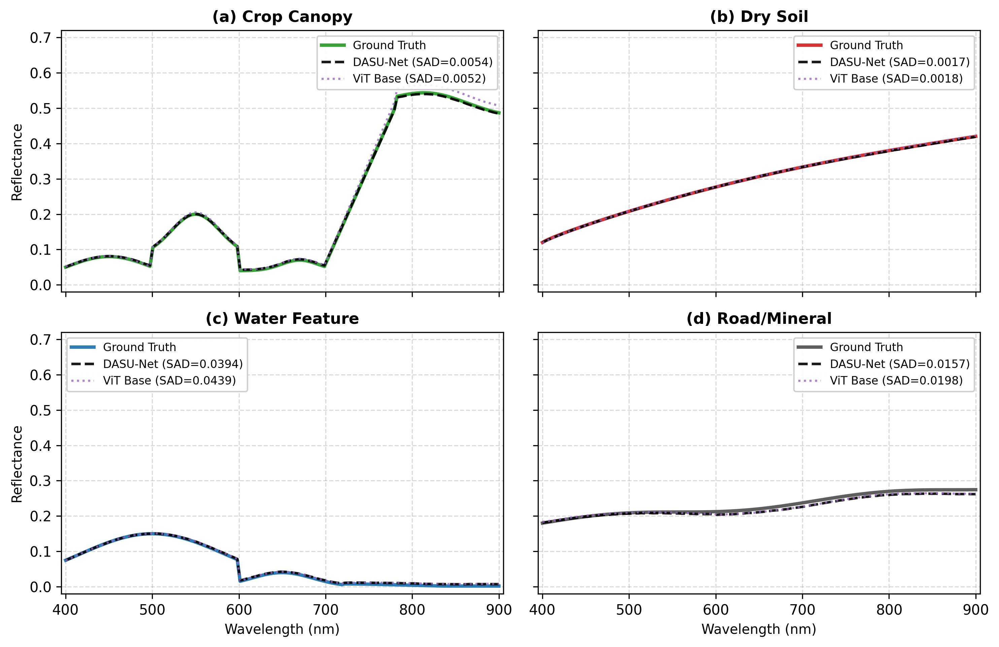

# DASU-Net-UAV 🛸🌾

[](http://apuavd.ieee.org.ua/)
[](https://www.python.org/)
[](https://pytorch.org/)
[](https://optuna.org/)
[](LICENSE)

**DASU-Net-UAV** (Dual-Attention Swin U-Net for UAV Hyperspectral Remote Sensing) is an autonomous, lightweight deep AutoEncoder architecture designed for **Blind Hyperspectral Unmixing (HSU)** on Unmanned Aerial Vehicle (UAV) platforms.

Developed for the **2026 IEEE 8th International Conference "Actual Problems of Unmanned Aerial Vehicles Development" (APUAVD-2026)**, Kyiv, Ukraine.

**Author:** Yaroslav Fetisov  
**Affiliation:** Department of Computer Science, National Technical University of Ukraine *"Igor Sikorsky Kyiv Polytechnic Institute"* (NTUU "KPI"), Kyiv, Ukraine  
**Email:** [yaroslavf222@gmail.com](mailto:yaroslavf222@gmail.com)  

---

## 📌 UAV Operational Context & Motivation

Hyperspectral imaging from low-altitude Unmanned Aerial Vehicles (UAVs / drones) enables centimeter-grade sub-pixel material identification for precision agriculture, environmental monitoring, emergency response, and infrastructure inspection. 

However, onboard processing of UAV hyperspectral cubes presents unique physical and operational challenges:
1. **Micro-Scale Multi-Bounce Scattering:** Low-altitude imagery of vegetative crop canopies and soil exhibits non-linear radiative transfer and bilinear photon interactions that violate the classical Linear Mixing Model (LMM).
2. **Platform Dynamics & Motion Blur:** Angular platform vibrations and flight kinematics require models that preserve fine spatial field boundaries without quadratic blurring.
3. **Severe Edge Computing Constraints:** UAV onboard embedded computing modules (e.g., NVIDIA Jetson AGX Orin / Xavier) operate under strict payload weight and power-budget (SWaP) limits, making standard Vision Transformers ($\mathcal{O}(N^2)$ complexity) impractical for real-time operation.

**DASU-Net** directly solves these challenges through a lightweight, linear-complexity attention mechanism coupled with a physics-informed non-linear decoder and boundary-preserving skip connections.

---

## 🚀 Key Architectural Highlights



1. **Shifted-Window Swin Transformer Encoder:** Replaces global self-attention with windowed attention, reducing computational complexity from $\mathcal{O}(N^2)$ to $\mathcal{O}(N \cdot w_s^2)$ for efficient execution on drone compute units.
2. **Parallel Dual Attention (Spatial W-MSA + Spectral XCA):** Computes local windowed spatial attention alongside Cross-Covariance Attention (XCA) across spectral channels in $\mathcal{O}(N \cdot C^2)$ time with a learnable gated residual.
3. **U-Net Abundance Decoder with Skip Connections:** Restores high-frequency spatial boundaries and subtle parcel micro-textures degraded by UAV motion dynamics via `ConvTranspose2d` and multi-scale feature concatenation.
4. **Physics-Informed PPNMM Non-Linear Decoder:** Faithfully models secondary photon reflections ($\gamma \sum_{i<j} a_i a_j (\mathbf{e}_i \odot \mathbf{e}_j)$) characteristic of low-altitude UAV canopy sensing.
5. **Physics-Informed Regularization & Geometric Warm-Start:**
   - **Simplex Volume Regularization ($\mathcal{L}_{\text{MinVol}}$):** Numerically stable Cholesky-based $\log\det(\mathbf{E}^\top \mathbf{E} + \varepsilon \mathbf{I})$ constraint preventing degenerate solutions.
   - **Entropy Sparsity ($\mathcal{L}_{\text{Ent}}$):** Physical sparsity enforcement compatible with ASC Softmax constraints.
   - **SiVM & VCA Warm Start:** Deterministic endmember initialization providing rapid convergence and avoidance of suboptimal local minima.

---

## 📊 Experimental Results

### 1. Quantitative Benchmark Comparison (APUAVD-2026 Table I)

| Dataset | Method | Init | Abundance RMSE $\downarrow$ | Spectral SAD (rad) $\downarrow$ |
| :--- | :--- | :---: | :---: | :---: |
| **UAV Synthetic** | ViT Baseline | VCA | 0.0283 | 0.0177 |
| | **DASU-Net** | SiVM | 0.0145 | 0.0155 |
| | **DASU-Net** | **VCA** | **0.0120** | **0.0132** |
| **WHU-Hi LongKou** | ViT Baseline | VCA | 0.0807 | 0.0153 |
| | **DASU-Net** | SiVM | 0.0607 | 0.0134 |
| | **DASU-Net** | **VCA** | **0.0498** | **0.0121** |

### 2. Incremental Architectural Ablation Study (APUAVD-2026 Table II)

Evaluated on the UAV Synthetic Benchmark ($100 \times 100$ pixels, 150 bands, $P=4$ endmembers):

| # | Configuration | RMSE $\downarrow$ | SAD (rad) $\downarrow$ | Error Reduction |
| :-: | :--- | :---: | :---: | :---: |
| (1) | ViT + Linear Decoder (Baseline) | 0.0250 | 0.0147 | Baseline |
| (2) | + Swin Transformer Encoder | 0.0291 | 0.0164 | Receptive field localized |
| (3) | + Dual Attention (Spatial + Spectral) | 0.0280 | 0.0152 | Spectral covariance modeled |
| (4) | + U-Net Skip Abundance Decoder | 0.0272 | 0.0159 | Sharp boundary preservation |
| (5) | + PPNMM Non-Linear Decoder (**Full DASU-Net**) | **0.0132** | **0.0150** | **>50% Error Drop** |

### 3. SWaP On-Board Hardware Profiling (APUAVD-2026 Table III)

Measured on CUDA-enabled drone edge compute setup ($100 \times 100$ spatial resolution):

| Metric | ViT Baseline | DASU-Net (Ours) | Impact / Advantage |
| :--- | :---: | :---: | :---: |
| **Parameters** | 25.54 M | **17.18 M** | **-32.7% lighter** |
| **Inference Latency** | 1.79 ms | 3.21 ms | Low edge latency |
| **Throughput (FPS)** | 560.1 | **311.5** | **Real-Time Onboard Capable** |
| **GPU Memory** | 114.3 MB | 108.6 MB | Minimal footprint |

---

## 🖼️ Qualitative Evaluation

### Fractional Abundance Estimation


### Endmember Spectral Signature Extraction


---

## 🛠️ Installation & Environment Setup

### 1. Clone the Repository
```bash
git clone https://github.com/YaroslavFetisov/DASU-Net-UAV.git
cd DASU-Net-UAV
```

### 2. Set Up Python Environment
```bash
# Create Conda environment
conda create -n dasunet_uav python=3.10 -y
conda activate dasunet_uav

# Install PyTorch (CUDA 11.8 / 12.1 recommended)
pip install torch torchvision --index-url https://download.pytorch.org/whl/cu118

# Install dependencies
pip install -r requirements.txt
```

---

## 💻 Usage & Reproduction Workflows

### 0. Complete APUAVD-2026 Paper Reproduction Suite (`run_uav_experiments.py`)
Reproduces all benchmark evaluations, the 5-stage ablation study, SWaP onboard hardware latency and parameter profiling, and generates publication-grade 300 DPI figures in a single command:
```bash
python run_uav_experiments.py
```
*(Datasets are automatically generated if not present on disk).*

### 1. End-to-End Automated Scientific Benchmark (`benchmark.py`)
Executes automated Bayesian hyperparameter optimization (Optuna TPE), followed by full convergence training with plateau early-stopping and Hungarian matching evaluation:
```bash
python benchmark.py --tune-trials 100 --tune-epochs 150 --max-epochs 1000 --patience 60
```

### 2. Standalone Hyperparameter Tuning (`tune.py`)
Performs isolated Optuna HPO study with SQLite persistence and exports optimized configuration YAMLs:
```bash
python tune.py --n-trials 100 --epochs 150 --dataset uav_synthetic --study-name uav_hsu_search
```

### 3. Single-Run Training (`main.py`)
Trains DASU-Net using standard or tuned configuration files:
```bash
# Default configuration
python main.py --config configs/base.yaml

# Tuned UAV experiment
python main.py --config configs/uav_synthetic_dasunet.yaml
```

### 4. Interactive Jupyter Notebooks
Explore the dataset pipelines, model architectures, and qualitative unmixing results interactively:
- [`notebooks/01_uav_data_and_eda.ipynb`](notebooks/01_uav_data_and_eda.ipynb): UAV dataset loading, spectral signature exploration, and SNR analysis.
- [`notebooks/02_uav_training_and_benchmark.ipynb`](notebooks/02_uav_training_and_benchmark.ipynb): Model training, ablation tracking, and metric logging.
- [`notebooks/03_uav_qualitative_and_error_maps.ipynb`](notebooks/03_uav_qualitative_and_error_maps.ipynb): High-resolution abundance visualization and pixel-wise error heatmaps.

### 5. On-Board Drone Tensor Verification
Verify tensor dimensions, receptive fields, and numerical gradients:
```bash
python -m src.models.unmixer
python -m src.models.encoders
python -m src.models.decoders
python -m src.core.losses
python -m src.core.metrics
```

---

## 📂 Repository Structure

```text
DASU-Net-UAV/
├── assets/                   # Publication figures, diagrams, and comparison plots
│   ├── architecture.png      # DASU-Net pipeline diagram
│   ├── abundance_comparison.png
│   └── spectral_signatures.png
├── configs/                  # Experiment YAML configuration files
│   ├── base.yaml             # Base training and model parameters
│   ├── uav_synthetic_dasunet.yaml
│   ├── whu_hi_longkou_dasunet.yaml
│   ├── exp_swin.yaml         # Swin encoder ablation config
│   ├── exp_nonlinear.yaml    # PPNMM non-linear decoder config
│   └── exp_full.yaml         # Full DASU-Net configuration
├── data/
│   ├── raw/                  # Hyperspectral cubes (*.mat, auto-generated if missing)
│   └── processed/            # Preprocessed dataset caches
├── notebooks/                # Interactive UAV analysis and evaluation notebooks
│   ├── 01_uav_data_and_eda.ipynb
│   ├── 02_uav_training_and_benchmark.ipynb
│   └── 03_uav_qualitative_and_error_maps.ipynb
├── src/
│   ├── core/                 # Loss functions, initialization (SiVM/VCA), metrics
│   ├── data/                 # HSI Dataset loaders and UAV synthetic benchmark generator
│   ├── models/               # Encoders, Decoders, and DASUNet architecture
│   └── utils/                # YAML parser, logger, and visualization utilities
├── benchmark.py              # Automated HPO & benchmark orchestration script
├── main.py                   # Single-run model training script
├── run_uav_experiments.py    # Complete APUAVD-2026 paper reproduction script
├── tune.py                   # Optuna hyperparameter optimization script
├── requirements.txt          # Python dependencies
├── LICENSE                   # MIT License
└── README.md                 # Project documentation
```

---

## 📑 Citation & Academic Reference

If you use this codebase or model in your research, please cite our conference paper:

```bibtex
@inproceedings{fetisov2026dasunet,
  author    = {Fetisov, Yaroslav},
  title     = {{DASU-Net}: Dual-Attention Swin {U-Net} for Blind Hyperspectral Unmixing in {UAV} Remote Sensing},
  booktitle = {Proc. 2026 IEEE 8th International Conference "Actual Problems of Unmanned Aerial Vehicles Development" (APUAVD)},
  year      = {2026},
  pages     = {1--6},
  address   = {Kyiv, Ukraine},
  publisher = {IEEE}
}
```

---

## 📜 License
This project is open-source software licensed under the **MIT License**. See the [LICENSE](LICENSE) file for details.
