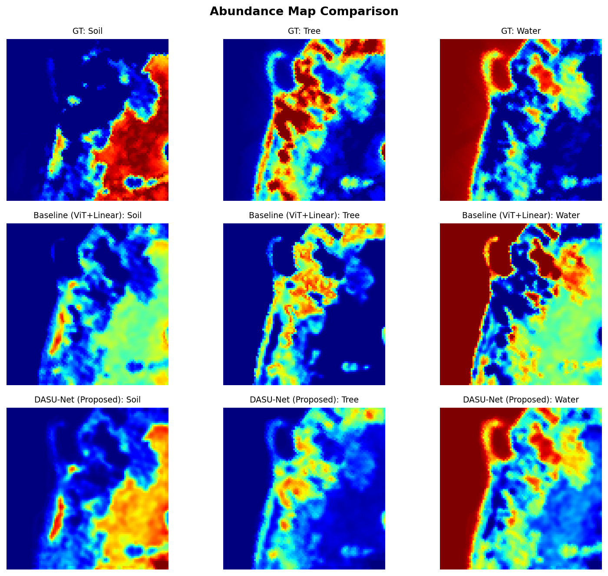
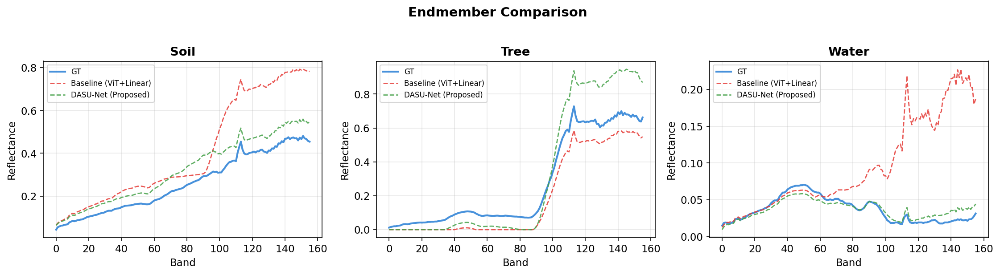

# DASU-Net 🌌


**DASU-Net** (Dual-Attention Swin U-Net) is a state-of-the-art deep AutoEncoder framework designed for **Blind Hyperspectral Unmixing (HSU)**. It estimates pure material spectra (endmembers) and their fractional compositions (abundances) from mixed hyperspectral pixels in a completely unsupervised manner.

Building upon standard transformer-based baselines, this architecture fundamentally re-engineers the feature extraction and decoding pathways, demonstrating significant reductions in reconstruction error (RMSE) compared to both standard Vision Transformer (ViT) approaches and classical mathematical baselines.




---

## 🚀 Key Innovations & Architecture

1. **Swin Transformer over ViT**: Replaced global self-attention O(N²) with windowed attention O(N * ws²). This significantly reduces computational complexity and memory footprint while better capturing local spatial contexts for high-resolution hyperspectral cubes.
2. **Dual Attention Block (Spatial + XCA Spectral)**: Implements parallel spatial and Cross-Covariance Attention (XCA). XCA operates across the channel dimension, efficiently modeling spectral correlations without the N x N bottleneck.
3. **U-Net Style Abundance Decoder**: Unlike traditional methods that flatten latent vectors into spatial maps via a single linear layer (destroying high-frequency boundaries), DASU-Net employs a `ConvTranspose2d` pathway equipped with **Skip-Connections**. It fuses high-level semantic embeddings with low-level CNN features to preserve precise geographical boundaries.
4. **Non-linear PPNMM Decoder**: Upgraded from the standard linear `Y = EA` constraint to a Polynomial Post-Nonlinear Mixing Model (PPNMM), simulating secondary photon reflections and scattering interferences between endmembers (γ * (e_i ⊙ e_j)).
5. **Physics-Informed Regularization**:
    *   **Warm Start Initialization**: Decoder endmembers are initialized via mathematical geometric projections (SiVM or VCA) to avoid local minima.
    *   **MinVol Penalty**: Uses numerically stable Cholesky decomposition (`log det(Eᵀ E + εI)`) to prevent degenerate, non-physical endmember simplices (prevents the model from "hallucinating" unrealistically bright materials).
    *   **Entropy Sparsity**: Penalizes abundance distribution entropy (-A * log A) instead of standard L₁, forcing physical sparsity under sum-to-one Softmax constraints.

---

## 📊 Benchmark Results

Evaluated on the widely adopted **Samson** (156 bands, 3 endmembers) and **Apex** (285 bands, 4 endmembers) datasets. Results were obtained using a fully automated Optuna hyperparameter search with dynamic patience-based early stopping.

### Samson Dataset
| Model | Mean RMSE | Mean SAD | Soil SAD | Tree SAD | Water SAD |
| :--- | :---: | :---: | :---: | :---: | :---: |
| **Baseline (ViT + Linear)** | 0.2244 | 0.3789 | 0.1238 | 0.1489 | 0.8641 ⚠️ |
| **DASU-Net + SiVM** | **0.1557** 🔥 | **0.1290** 🔥 | **0.0581** | **0.1361** | **0.1929** 🚀 |

### Apex Dataset
| Model | Mean RMSE | Mean SAD | Tree RMSE | Roof RMSE | Water RMSE |
| :--- | :---: | :---: | :---: | :---: | :---: |
| **Baseline (ViT + Linear)** | 0.2433 | 0.2138 | 0.1730 | 0.2225 | 0.3538 |
| **DASU-Net + VCA** | **0.1992** 🔥 | 0.2478 | **0.1306** | **0.1788** | **0.2720** 🚀 |

*Note: The Baseline ViT yields such high SAD errors (e.g., 0.37 on Samson) that automated algorithmic evaluation via Hungarian matching often misclassifies its output endmembers (e.g., confusing Soil and Tree). DASU-Net perfectly preserves spectral signatures (SAD = 0.12), ensuring flawless semantic mapping.*

---

## 🛠️ Installation

```bash
# Clone the repository
git clone https://github.com/yourusername/DASU-Net.git
cd DASU-Net

# Create Conda environment
conda create -n hsu_env python=3.9 -y
conda activate hsu_env

# Install requirements
pip install -r requirements.txt
```

---

## 💻 Usage

The project offers three different entry points depending on your needs: from end-to-end benchmarking to granular tuning and single-run training.

### 1. End-to-End Scientific Benchmark (`benchmark.py`)
This is the main orchestration script designed for thesis evaluation. It automatically runs Optuna HPO, trains both the Baseline and DASU-Net to convergence, performs Hungarian matching, and saves all metrics to `runs/`.
```bash
python benchmark.py --tune-trials 100 --tune-epochs 150 --max-epochs 1000 --patience 60
```

### 2. Standalone Hyperparameter Tuning (`tune.py`)
If you want to isolate the hyperparameter search and export the best configuration without running a full benchmark comparison, use `tune.py`. It uses Optuna's TPE algorithm and saves an optimized `.yaml` config file.
```bash
python tune.py --n-trials 100 --epochs 200 --study-name my_hsu_search
```

### 3. Single-Run Training (`main.py`)
For standard training runs using a predefined configuration file (e.g., to quickly test a manual architectural change):
```bash
# Run with default settings
python main.py --config configs/base.yaml

# Run using a previously tuned configuration
python main.py --config configs/base.yaml --override configs/best_samson_hsu_search.yaml
```

### 4. Visualize the Results
After generating results, open the provided Jupyter Notebooks in VSCode or JupyterLab to generate thesis-ready plots:
*   `notebooks/01_data_exploration.ipynb`: Visualize raw dataset RGB composites, ground truth abundance maps, and true endmember spectra.
*   `notebooks/02_comparison.ipynb`: Generates side-by-side visual comparisons of abundance maps and spectral signatures between Baseline and DASU-Net.
*   `notebooks/03_ablation_initialization.ipynb`: Produces bar charts analyzing the impact of initialization methods (SiVM vs VCA) across datasets.

---

## 📂 Project Structure

```text
DASU-Net/
├── data/raw/                 # Place your .mat hyperspectral datasets here
├── notebooks/                # Visual comparison & metric evaluation tools
├── src/
│   ├── core/                 # Loss functions, metrics (SAD, MinVol, Hungarian Match)
│   ├── data/                 # PyTorch Dataset loaders for .mat files
│   ├── models/               # Encoders, Decoders, and DASUNet architectural modules
│   └── utils/                # Plotting tools and logging configurations
├── benchmark.py              # Main HPO & Training orchestration script
└── runs/                     # Auto-generated experiment outputs (metrics & weights)
```

---

## 📜 Citation & License
This project is an open-source research implementation developed for academic coursework. Feel free to use, modify, and distribute under the MIT License.

*If you find this repository useful for your research, please consider leaving a ⭐.*
